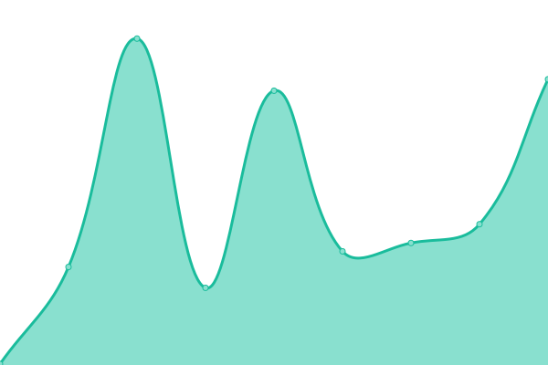

# [📈 Live Status](https://iharshgor.github.io/upptime): <!--live status--> **🟩 All systems operational**

This repository contains the open-source uptime monitor and status page for [Harsh Gor](iharshgor.com), powered by [Upptime](https://github.com/upptime/upptime).

With [Upptime](https://upptime.js.org), you can get your own unlimited and free uptime monitor and status page, powered entirely by a GitHub repository. We use [Issues](https://github.com/iharshgor/upptime/issues) as incident reports, [Actions](https://github.com/iharshgor/upptime/actions) as uptime monitors, and [Pages](https://iharshgor.github.io/upptime) for the status page.

<!--start: status pages-->
<!-- This summary is generated by Upptime (https://github.com/upptime/upptime) -->
<!-- Do not edit this manually, your changes will be overwritten -->
<!-- prettier-ignore -->
| URL | Status | History | Response Time | Uptime |
| --- | ------ | ------- | ------------- | ------ |
|  [iharshgor](https://iharshgor.com) | 🟩 Up | [iharshgor.yml](https://github.com/iharshgor/upptime/commits/HEAD/history/iharshgor.yml) | 

 150ms
     
 | 

<a href="https://iharshgor.github.io/upptime/history/iharshgor">100.00%</a>
    

|  [Designly Frontend](https://designlylabs.com) | 🟩 Up | [designly-frontend.yml](https://github.com/iharshgor/upptime/commits/HEAD/history/designly-frontend.yml) | 

 166ms
     
 | 

<a href="https://iharshgor.github.io/upptime/history/designly-frontend">100.00%</a>
    

|  [Designly Admin](https://admin.designlylabs.com/admin) | 🟩 Up | [designly-admin.yml](https://github.com/iharshgor/upptime/commits/HEAD/history/designly-admin.yml) | 

 128ms
     
 | 

<a href="https://iharshgor.github.io/upptime/history/designly-admin">100.00%</a>
    

|  [Designly Backend](https://api.designlylabs.com/status) | 🟩 Up | [designly-backend.yml](https://github.com/iharshgor/upptime/commits/HEAD/history/designly-backend.yml) | 

 101ms
     
 | 

<a href="https://iharshgor.github.io/upptime/history/designly-backend">100.00%</a>
    

|  [Designly Scrapper](https://scrap.designlylabs.com/status) | 🟩 Up | [designly-scrapper.yml](https://github.com/iharshgor/upptime/commits/HEAD/history/designly-scrapper.yml) | 

 134ms
     
 | 

<a href="https://iharshgor.github.io/upptime/history/designly-scrapper">99.80%</a>
    

|  [ZenDesk Admin](https://zen.solz.me) | 🟩 Up | [zen-desk-admin.yml](https://github.com/iharshgor/upptime/commits/HEAD/history/zen-desk-admin.yml) | 

 229ms
     
 | 

<a href="https://iharshgor.github.io/upptime/history/zen-desk-admin">100.00%</a>
    

|  [ZenDesk Backend](https://zen-api.solz.me/admin) | 🟩 Up | [zen-desk-backend.yml](https://github.com/iharshgor/upptime/commits/HEAD/history/zen-desk-backend.yml) | 

 286ms
     
 | 

<a href="https://iharshgor.github.io/upptime/history/zen-desk-backend">100.00%</a>
    

|  [Nurses Now Backend](https://nurses-now-api.solz.me/api/status) | 🟩 Up | [nurses-now-backend.yml](https://github.com/iharshgor/upptime/commits/HEAD/history/nurses-now-backend.yml) | 

 553ms
     
 | 

<a href="https://iharshgor.github.io/upptime/history/nurses-now-backend">100.00%</a>
    

|  [Nurses Now Facility](https://nurses-now-facility.solz.me/login) | 🟩 Up | [nurses-now-facility.yml](https://github.com/iharshgor/upptime/commits/HEAD/history/nurses-now-facility.yml) | 

 570ms
     
 | 

<a href="https://iharshgor.github.io/upptime/history/nurses-now-facility">100.00%</a>
    

|  [Nurses Now Admin](https://nurses-now-admin.solz.me/login) | 🟩 Up | [nurses-now-admin.yml](https://github.com/iharshgor/upptime/commits/HEAD/history/nurses-now-admin.yml) | 

 592ms
     
 | 

<a href="https://iharshgor.github.io/upptime/history/nurses-now-admin">100.00%</a>
    

|  [Nurses Now Recommender](https://nurses-now-recommender.solz.me/docs) | 🟩 Up | [nurses-now-recommender.yml](https://github.com/iharshgor/upptime/commits/HEAD/history/nurses-now-recommender.yml) | 

 553ms
     
 | 

<a href="https://iharshgor.github.io/upptime/history/nurses-now-recommender">100.00%</a>
    

|  [TriSteel Admin](https://ts-admin.solz.me/login) | 🟩 Up | [tri-steel-admin.yml](https://github.com/iharshgor/upptime/commits/HEAD/history/tri-steel-admin.yml) | 

 784ms
     
 | 

<a href="https://iharshgor.github.io/upptime/history/tri-steel-admin">100.00%</a>
    

|  [TriSteel Customer](https://ts-customer.solz.me/Account/Login) | 🟩 Up | [tri-steel-customer.yml](https://github.com/iharshgor/upptime/commits/HEAD/history/tri-steel-customer.yml) | 

 800ms
     
 | 

<a href="https://iharshgor.github.io/upptime/history/tri-steel-customer">100.00%</a>
    

<!--end: status pages-->

[**Visit our status website →**](https://iharshgor.github.io/upptime)

## 📄 License

- Powered by: [Upptime](https://github.com/upptime/upptime)
- Code: [MIT](./LICENSE) © [Anand Chowdhary](https://anandchowdhary.com), supported by [Pabio](https://pabio.com)
- Data in the `./history` directory: [Open Database License](https://opendatacommons.org/licenses/odbl/1-0/)
